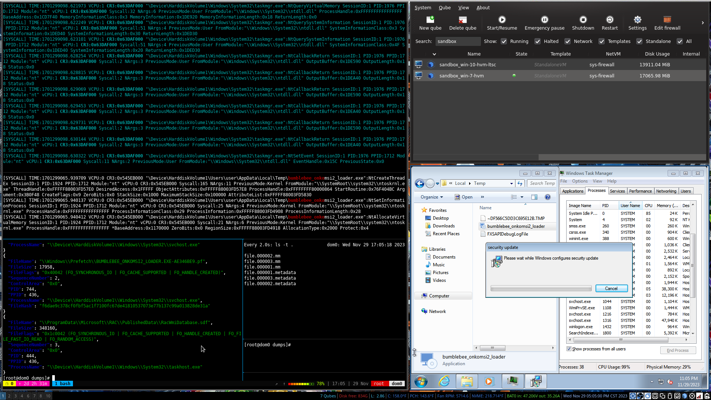

# DRAKVUF® Black-box Binary Analysis System (Qubes 4.2)
***DRAKVUF® + libVMI + volatility3 + dwarf2json*** 
***(tested on QubesOS 4.2.0-rc5 + Xen 4.17.2-5)***

>[!IMPORTANT] Support open-source projects! Please take the time to [donate directly to the Qubes OS Project](https://www.qubes-os.org/donate/) alternatively, buy some cool [Qubes shirts/swag from Cyphermarket](https://www.cyphermarket.com/qubes/) an outfit that donates [50% of their profits](https://www.cyphermarket.com/about-cypher-market/) to the Qubes OS Project and other FOSS projects. If you find DRAKVUF® useful, consider [donating](https://www.honeynet.org/2012/12/18/donate-to-the-honeynet-project/) to the [Honeynet Project](https://www.honeynet.org/) who supports the development of DRAKVUF®.

> [!WARNING] Before stepping into the technical depth of this guide, be aware that a general understanding of key security and virtualization concepts, as well as intermediate to advanced familiarity with QubesOS and Xen internals, is a prerequisite.

  Before diving into the complexities of setting up DRAKVUF on QubesOS, a little introductory context on both. QubesOS is a reasonably secure Xen-based distribution of Linux operating system that compartmentalizes your digital life into isolated virtual machines. DRAKVUF, on the other hand,  is a binary analysis tool that uses Xen-based virtualization machine inspection to track the execution of arbitrary binaries - an invaluable tool for malware analysts and cybersecurity researchers.

   **DRAKVUF, as stated on the [official website](https://drakvuf.com/), *is an agentless black-box binary analysis system based on virtualization. It traces the execution of arbitrary binaries, including operating systems, without the need for specialized software like agents installed within the virtual machine to conduct the analysis.***
  
   In this guide, I delve into how to use these powerful security-focused Xen projects together. 
   
> :warning: **Working with DRAKVUF in a Qubes environment necessitates patching qubes-vmm-xen to enable the external altp2m modality in Xen Hypervisor as well as adding or modifying commandline argument(s) supplied to GRUB_CMDLINE_XEN_DEFAULT.**

> :warning: **This guide may deviate from accepted hygienic Qubes best security practices, violate dom0 isolation concepts, and modify other sane defaults put forward by the Qubes OS project. VM introspection is not officially supported and poses many problems to the security of a system like Qubes OS architecture-wise. VMI access to all domains may negate any hard isolation between them.**

> :warning: **Executing malware, even in a sandboxed environment, could have unintended consequences. Also, transferring externally compiled qubes-builder appVM untrusted binaries and CLI tools into dom0 into dom0 must be done with utmost caution especially those designed to analyze and manipulate potentially malicious memory dumps, carved files, and other artifacts.**

> :information_source: **Cautionary warnings aside, the author will try to adhere to Qubes security practices to ensure the integrity of dom0 (e.g. pulling down GPG keys of DRAKVUF, libVMI, dwarf2json, and volatility3 developers, verifying git release tags and/or commit signatures where possible).**

it is inadvisable to add options to Xen's commandline that one does not fully understand the implications. Not only can misconfigured/incoherent Xen options introduce instability to the environment, weaken the security posture of Xen hypervisor, but also have the potential to increase the overall attack surface of Qubes.

To properly configure Xen for DRAKVUF - while maintaining the security and integrity of your Qubes system - it's quintessential to understand the implications of each command-line option. 

Let's break the [DRAKVUF recommended](https://github.com/tklengyel/drakvuf/blob/1859dc9657e5ccab5ce925fe60980378544f2f88/package/extra/etc/default/grub.d/xen.cfg#L46) xen.cfg options [commandline options](https://xenbits.xen.org/docs/unstable/misc/xen-command-line.html) down one-by-one:
`GRUB_CMDLINE_XEN_DEFAULT="dom0_mem=2048M,max:2048M dom0_max_vcpus=2 dom0_vcpus_pin=1 force-ept=1 ept=ad=0 hap_1gb=0 hap_2mb=0 altp2m=1 hpet=legacy-replacement smt=0 sched=credit"`

1. `dom0_mem=2048M,max:2048M dom0_max_vcpus=2 dom0_vcpus_pin=1`: These options set a hard memory maximum allocation of 2048M for dom0 (adjust as needed)as well as [define the maximum number of dom0 vCPUs and number of vCPUs to pin to dom0](https://wiki.xenproject.org/wiki/Tuning_Xen_for_Performance#Dom0_vCPUs). If you go this route don't forget to create a [xen-user.xml](https://forum.qubes-os.org/t/why-are-updates-forcing-the-grub-smt-off-option/15326/12) to appropriately exclude the vCPUs you pin to dom0. domU guest [vCPUs can optionally be pinned](https://wiki.xenproject.org/wiki/Tuning_Xen_for_Performance#vCPU_Pinning_for_guests) as well. 
    > [!INFO] Anecdotal reports suggest [the above arguments are not strictly required for DRAKVUF](https://pub.nethence.com/security/drakvuf) to function normally.

2. `force-ept=1`: This appropriately named option forces Xen to use Extended Page Tables (EPT), crucial for use of Intel's [Hardware Assisted Paging (HAP)](https://wiki.xenproject.org/wiki/Tuning_Xen_for_Performance#HAP_vs._shadow) implementation. The AMD work-alike equivalent of EPT is named [Rapid Virtualization Indexing (RVI)](https://www.techtarget.com/searchitoperations/definition/AMD-V-AMD-virtualization). 

    Xen project history boffins will fondly remember these enhancements were introduced back in [version 4.5](https://xenproject.org/2015/01/15/less-is-more-in-the-new-xen-project-4-5-release/)  
    
    Some proponents of forcing EPT/RVI suggest it _could_ help improve nested virtuailization performance (as in running Xen on QEMU or Xen-on-Xen etc). Nested virtualization is a (divisive topic) sure to spur spirited debate amongst users on both sides of the security vs. performance tradeoff argument. 
    
    Worthwhile to note: the author first tested DRAKVUF on Qubes in a nested virtualization equipped Ubuntu HVM by extending `libvirt/xen.xml`. In Qubes 4.2.0-rc5 this process involves dropping an xml file following the name schema of the target domain `ubuntu-hvm.xml` in`/etc/qubes/templates/libvirt/xen/by-name` to require CPU features Intel VT-x `vmx`, AMD-V `svm` in the target HVM. As well as other features `hap=1`, and `nestedhvm=1` like this [https://forum.qubes-os.org/t/run-vms-in-proxmox-in-qubesos-crashes/17477#enable-virtualization-for-proxmox-qubesvm-in-qubesosxen-6](example):
```xml
[root@dom0 by-name]# cat ubuntu-hvm.xml 

    <cpu mode='host-passthrough'>
        <feature name='vmx' policy='require'/>
        <feature name='svm' policy='require'/>
    </cpu>


    <pae/>
    <acpi/>
    <apic/>
    <nestedhvm/>
    <hap state='on'/> <!-- enable Hardware Assisted Paging -->
    <!-- <altp2m mode='external'/> don't bother messing with altp2m modes with libvirt -->


```
  >[!INFO] Performance wise, DRAKVUF in the nested Qubes Xen-on-Xen Ubuntu HVM virtualization environment was untenable on my machine. Consider yourself informed if you opt to go the nested HVM route. 

3. `ept=ad=0`: Shortly put this option disables the accessed and thus "dirty" or sullied flags in EPT. Inevitably resulting in a performance as it was introduced as a protective measure against the [Meltdown](https://en.wikipedia.org/wiki/Meltdown_(security_vulnerability) [transient execution class](https://www.usenix.org/system/files/sec19fall_canella_prepub.pdf) of CPU vulnerabilities back in 2018. A mechanism to keep track of whether an arbitrary memory page has been accessed or modified theoretically increases the difficulty for exploitation.

4. `hap_1gb=0` and `hap_2mb=0`: These flags disable the use of 1GB and 2MB page sizes (Huge Pages) with hardware-assisted paging (HAP). Huge pages can improve performance, but, if you are noticing a developing trend here, it comes at a security tradeoff. Potentially increasing the granularity of memory protection and perhaps increasing the vulnerability to certain types of attacks like [Rowhammer](https://en.wikipedia.org/wiki/Row_hammer) 

 5. `hpet=legacy-replacement`: this option forces Xen to use of High Precision Event Timer (HPET) over other more modern clock sources. HPET is definitely slower than alternatives - namely TSC. Frankly, I'm not even certain you need this particular commandline option since Xen outright disables it on my machine with some prejudice citing irreliability concerns:
```bash
  [root@dom0 ~]$ xl dmesg | grep -i 'hpet'
  (XEN) ACPI: HPET 99B3A350, 0038 (r1 COREv4 COREBOOT 0 CORE 20220331)
  (XEN) Disabling HPET for being unreliable
```
 6. `smt=0|smt=off`:  Now heres a commandline option that should be more familiar to Qubes users than most others. This option disables Simultaneous Multithreading (SMT, aka Hyper-Threading on Intel CPUs). SMT is known for its performance benefits, but it also poses potential security risks, in cases of notable side-channel attacks namely [Spectre](https://spectreattack.com/spectre.pdf) so in Qubes it is [off by default in xen.spec.in](https://github.com/QubesOS/qubes-vmm-xen/blob/bd8302945c876f9c53590f69cf89622af74d5748/xen.spec.in#L756-L774). 

7. `altp2m=1`:  Last but not least, this this boolean enables Xen's alternate p2m (physical-to-machine) functionality that is a [https://github.com/tklengyel/drakvuf/wiki/Xen-altp2m#stealthy-monitoring-with-xen-altp2m](game changer for external monitoring). Toggling This feature allows Xen hypervisor to present different views of physical memory to the domU guests, intended to provide isolation between the views while enhancing the capacity for [stealthy introspection](https://github.com/tklengyel/drakvuf/wiki/Xen-altp2m#stealthy-monitoring-with-xen-altp2m)

    While altp2m enhances your visibility into Xen domUs, the added complexity may inadvertently make your system more vulnerable. The creator of DRAKVUF [(Dr. Tamas K Lengyel](https://tklengyel.com/) touches on a few of the [Footguns, Pitfalls, and Limits of Dynamic Malware Analysis](https://www.cesar-conference.org/wp-content/uploads/2019/12/11h30_T-LENGYEL_PITFALLS_LIMITS_DYNAMIC_MALWARE_ANALYSIS2.pdf) 

8. `sched=credit`: This option enables Xen's [Credit Scheduler](https://wiki.xenproject.org/wiki/Credit_Scheduler), one of four different [scheduler options](https://wiki.xenproject.org/wiki/Category:Scheduler) presently available. Credit scheduling helps to fairly distribute CPU resources across VMs, focusing on load balancing and general-purpose use rather than security. Remember that different schedulers carry their unique characteristic quirks that might affect system stability and could potentially be manipulated as attack vectors.

    In the case of the credit scheduler, it's plausible that one could craft a side-channel attack exploiting processor performance enhancements - like speculative execution and cache sharing. A misbehaving VM might misuse these attributes to execute side-channel attacks similar to Meltdown and Spectre - effectively exploiting the scheduling of virtual domains (domUs) on shared physical CPUs to leak data.

    Compared to the Credit Scheduler, a blend of CPU pinning and core scheduling can offer additional isolation between VMs, thereby alleviating _some_ risks posed by side-channel exploits. CPU Pinning (`dom0_vcpus_pin`) assigns specific physical CPUs (**pCPUs**) to VMs' virtual CPUs (**vCPUs**), which can minimize cross-domain interference and lower the likelihood of side-channel attacks.

    The [Core Scheduling Granularity](http://xenbits.xen.org/docs/unstable/misc/xen-command-line.html#sched-gran-x86) (`sched-gran=core`) option, on the other hand, schedules _**all threads**_ on a core simultaneously. This approach helps maintain isolation even when Simultaneous Multi-Threading (SMT) is in use, providing mitigation against threats from inter-thread Spectre-style attacks. Ideally, an innocent sibling thread won't get scheduled alongside a potentially harmful thread from a different VM on the same core, reducing the attack surface.

    Off-topic yet tangentially related subject regarding Intel Hyper-Threading and Xen schedulers - while not compatible with DRAKVUF enabling SMT can provide enhanced performance and can be done reasonably safely on Qubes. Combining the setting of a maximum dom0 vCPU limit and pinning them, following the ['safely' use hyperthreading](https://github.com/QubesOS/qubes-issues/issues/5547) advice from qubes-issue #5547, can yield measurable performance improvements. 
    
    For instance, this author uses parameters: `dom0_max_vcpus=4 dom0_vcpus_pin smt=on sched-gran=core`on their non-DRAKVUF desktop machine running Qubes r4.1. If you go this route remember also to create a [xen-user.xml](https://forum.qubes-os.org/t/why-are-updates-forcing-the-grub-smt-off-option/15326/12) and optionally [pin certain vCPUs to guests](https://wiki.xenproject.org/wiki/Tuning_Xen_for_Performance#vCPU_Pinning_for_guests). For those whose threat model allows latitude, these modifications could potentially eek out extra performance from Hyper-Threading while tackling _some_ of the associated risks.

### A word on backups

Take manual LVM snapshots of sandbox HVMs using LVM CLI tools in dom0 (`lvcreate -n sandbox_hvm_backup -s qubes_dom0/vm-sandbox_hvm`) prior to executing any malware. You can also revert to 1 of the [2 volume revisions kept by default](https://dev.qubes-os.org/projects/core-admin/en/latest/qubes-storage.html#storage-pool-concept) using Qubes native tools [`qvm-volume`](https://www.qubes-os.org/doc/volume-backup-revert/) to a point prior to when the malware was executed.

Regular total system [backups](https://www.qubes-os.org/doc/how-to-back-up-restore-and-migrate/) can be made with `qubes-backup` or with LVM backup tools developed by the community designed for Qubes like [wyng](https://github.com/tasket/wyng-backup). Consider automating [LVM snapshots of dom0's root](https://github.com/tasket/wyng-backup/issues/53#issuecomment-1731878936) at each shutdown with systemd.

Before we go any further, (***skip to the bottom if you want to jump straight to the step-by-step!)*** let's talk through some hypothetical security scenarios specific to Qubes, Drakvuf, LibVMI, and Xen.
    
### Scenario 1: Instrospection negates hard isolation between Qubes domains (covert side channels)

Joanna Rutkovska and Tamas K Lengyel, respective creators of QubesOS and Drakvuf, discuss the security implications of VM introspection with regard to Qubes OS architecture in their [GitHub](https://github.com/QubesOS/qubes-issues/issues/2417#issuecomment-258604397)[dialogues](https://github.com/QubesOS/qubes-issues/issues/2417#issuecomment-264290983) in issue #2417. The overarching concerns are the potential for undermining hard isolation between Qubes domains and potential establishment of covert channels between VMs.

To counter these vulnerabilities, enabling Flask/XSM in Qubes and implementing the suggested policy as demonstrated in this [commit](https://github.com/tklengyel/xen/commit/bfdf2068b1ddf4eb1cd8338375f6f76afe862f63) might enhance overall system security. A proper Flask/XSM implementation could offer more granular and precise access control mechanismx, thereby considerably reducing the hypervisor attack surface. 

Unfortunately, Flask/XSM is not yet fully integrated into Qubes. This is still true today as of this writing in Qubes 4.2.0-rc5.

### Scenario 2: Exploiting File Extractor/Memdump Plugin

  The [file extractor plugin](https://github.com/tklengyel/drakvuf/blob/main/src/plugins/fileextractor/fileextractor.cpp) in Drakvuf works by carving out PE/MZ and other files from the memory of a sandboxed Windows HVM. It seems likely that it does this based on the magic byte, although a thorough inspection of the underlying C++ code would be necessary to confirm this. 

  These carved files quite possibly contain malicious .NET code or other malicious payloads intended for execution in MS-DOS. However, this approach carries substantial security risks. Even if we divert all the carved files to an offline Vault or disposable VM (dispVM), there remains a possibility of insecure data handling within dom0 during the transfer, enabling the potential for arbitrary code to be executed in dom0.

### Scenario 3: Undiscovered Vulnerabilities in LibVMI or Drakvuf

Assumingly there is a yet-undiscovered vulnerability in LibVMI or Drakvuf, a technically skilled attacker could possibly engineer a specific memory layout or other condition within the monitored guest domain. When this domain is introspected, it could trigger the hypothertical vulnerability, potentially leading to undefined behavior, code execution, or privilege escalation within dom0.

### Scenario 4: Abuse of `altp2m` views

`altp2m` provides multiple views of guest physical memory. Seeing as these modes can be set at [runtime using `xc_hvm_param_set`](https://github.com/tklengyel/drakvuf/pull/681/commits) a sophisticated attacker could, theoretically, manipulate this mechanism's bugs or boundary cases to mislead libvmi, confusing it to change [modalities](https://xenbits.xen.org/docs/unstable/man/xl.cfg.5.html#altp2m-MODE) (say from "external only to "mixed") which could result it in-guest access to the altp2m interface. At the very least, such manipulation coud falsify forensic data, and at worst, leverage potential vulnerabilities in the introspection tool itself, resulting compromise or even a potential hypervisor breakout.

### Scenario 5: Memory Analysis Exploitation

With the use of the [memdump](https://github.com/tklengyel/drakvuf/blob/main/src/plugins/memdump/memdump.cpp) plugin, complete memory segments from a guest's operating system (domU) are dumped into dom0 for subsequent analysis. 

Let's assume the malware sample executed within our sandbox is more modern and possesses VM detection and anti-debugging logic - something roughly akin to [Al-Khaser](https://github.com/LordNoteworthy/al-khaser#features). 

The malware probes the sandboxed environment and conclusively identifies it as a Xen hypervisor aware VM by checking that your network interface MAC address starts with the [Xen (OUI) Prefix](https://wiki.xenproject.org/wiki/Xen_Networking#MAC_addresses) `"\x00\x16\x3E"` or `00:16:3e` or detects the installation of Windows Xen PV drivers or Qubes Windows Tools [QWT/qubes-windows-tools-cross](https://github.com/tabit-pro/qubes-windows-tools-cross/). 

>[!WARNING] It is advisable to discontinue using QWT and Xen Project's Windows PV drivers in light of the[recent](https://lists.xenproject.org/archives/html/xen-announce/2023-07/msg00000.html) [compromise](https://www.qubes-os.org/news/2023/07/27/qsb-091/).

Once Al-Khaser or a similar functionality identifies your Xen HVM, the executing malware may start deliberately positioning specially crafted code, buffer overflow, or poisoned data in its memory space. As an example, consider a scenario with a parsing tool that has a buffer overflow vulnerability. The exact memory layout of the monitored guest VM could then trigger this overflow, leading to arbitrary code execution or a denial of service in the normally isolated dom0. 

Luckily, DRAKVUF's breakpoints are [safeguarded with EPT](https://github.com/tklengyel/drakvuf/issues/221), making it impossible for malware within the guest to directly detect or remove them. These breakpoints are also directly trapped to the hypervisor, further preventing malware from disabling them.

### Scenarios Final Word

Several thought-provoking scenarios indeed exist. However, the high technical hurdle needed to carry out such attacks provides some degree of reassurance. Although unlikely, they cannot be ignored especially if APTs or other nation-state actors fit within your threat model [https://nitter.net/corcra/status/605356172158332929]("Your threat model is not my threat model but yours is cool too") 

Admittedly, a scenario 5 attack as described would be highly targeted and require a detailed prior understanding of the analysis software stack and security-focused OS the  target is using. If one finds themselves at the receiving end of such a sophisticated attack, it's reasonable to assume that surveilled in other, more cost effective effective ways.

Furthermore, Qubes patches are designed to harden Xen hypervisor against such threats. Refer to the numerous [XSA](https://xenbits.xen.org/xsa/) Xen security advisories where vanilla Xen hypervisor is vulnerable but [Qubes](https://www.qubes-os.org/news/2023/10/10/xsas-released-on-2023-10-10/#xsas-that-do-not-affect-the-security-of-qubes-os) is not.

For the author, as a security engineer, hypothesizing and unraveling such scenarios is an intriguing exercise. They serve as valuable thought experiments that prompt regular re-evaluation of one's own operational security (OPSEC) and continuous iteration upon one's security posture. Even if your threat model doesn't warrant considering these extremes, at the very least such exercises keep you sharp and hypervigilant.

In summary, it's always wise to proceed with caution! Realistically evaluate risks against your personal threat model and avoid aggrandizing perceived threats that aren't grounded in reality.

As we progress through the guide, we'll aim to mitigate these risks and minimize the exposure surface of dom0. We'll strive to adhere to all Qubes security hygiene and best practices laid out by the team at Invisible Labs (e.g., verifying git signatures, validating GPG signatures, taking extra precautions when moving files, folders, repositories, and potentially malicious artifacts to/from dom0, etc.).

#### Qubes-builder + qubes-vmm-xen + altp2mhvm

To get started, we'll need to download or "pull down" qubes-builder, a tool that helps us build Qubes from source. We'll be making a small modification to qubes-vmm-xen via a patch, a component of Qubes that provides the entire Xen hypervisor and associated RPM packages. We'll add a single patch to Xen and install the resulting RPMs we build in dom0, the administrative isolated domain in Qubes.

If any of that makes you uncomfortable, well great! Let's commiserate because you're in good company. This author shared the same reservations at the beginning of this daunting process. Let's begin! 

1. Create untrusted-qubes-builder appVM from the fedora-37 template (*fedora-37-minimal might also work adjust accordingly*):
```bash
[armchairshaman@dom0 ~]$ qvm-template install fedora-37
[armchairshaman@dom0 ~]$ qvm-create --template fedora-37 --label red untrusted-qubes-builder
[armchairshaman@dom0 ~]$ qvm-volume resize untrusted-qubes-builder:private 16106127360
[armchairshaman@dom0 ~]$ qvm-volume resize untrusted-qubes-builder:root 21474836480
[armchairshaman@dom0 ~]$ qvm-prefs untrusted-qubes-builder vcpus 4
[armchairshaman@dom0 ~]$ qvm-prefs untrusted-qubes-builder memory 4000```
2. From untrusted-qubes-builder clone https://github.com/QubesOS/qubes-builder and https://github.com/QubesOS/qubes-vmm-xen:
   ```bash
[user@untrusted-qubes-builder ~]$ git clone https://github.com/QubesOS/qubes-builder && cd qubes-builder
Cloning into 'qubes-builder'...
remote: Enumerating objects: 7303, done.
remote: Counting objects: 100% (625/625), done.
remote: Compressing objects: 100% (281/281), done.
remote: Total 7303 (delta 370), reused 586 (delta 344), pack-reused 6678
Receiving objects: 100% (7303/7303), 4.41 MiB | 405.00 KiB/s, done.
Resolving deltas: 100% (4317/4317), done.

[user@untrusted-qubes-builder qubes-builder]$ git clone https://github.com/QubesOS/qubes-vmm-xen
Cloning into 'qubes-vmm-xen'...
remote: Enumerating objects: 7837, done.
remote: Counting objects: 100% (1066/1066), done.
remote: Compressing objects: 100% (111/111), done.
remote: Total 7837 (delta 984), reused 963 (delta 955), pack-reused 6771
Receiving objects: 100% (7837/7837), 6.62 MiB | 723.00 KiB/s, done.
Resolving deltas: 100% (3871/3871), done.
```
3. Create builder.conf in ~/qubes-builder:
```bash
[user@untrusted-qubes-builder qubes-builder]$ vim builder.conf
RELEASE := 4.2 
DIST_DOM0 ?= fc37
include example-configs/qubes-os-r$(RELEASE).conf

# main == 4.17.2-5 as of this writing
BRANCH_qubes-vmm-xen = main

# adjust these for building different pkgs/targets
# you have to manually resolve the dependencies!
COMPONENTS = vmm-xen builder-rpm
DISTS_VM = ""

# mostly needed for kernel builds
USE_QUBES_REPO_VERSION = $(RELEASE)
```
4. Grab distro gpg keys:
```bash
[user@untrusted-qubes-builder qubes-builder]$ sudo dnf install distribution-gpg-keys -y
```
5. A .patch file is a text file that contains the differences between two sets of code. It's a way of showing what changes need to be made to the original code in order to turn it into the updated code Create the .patch file below in the vmm-xen folder named `1203-libxl-altp2m-default.patch` and also add it to `xen.spec.in`:
```bash
[user@untrusted-qubes-builder qubes-vmm-xen]$ vim 1203-libxl-altp2m-default.patch 
--- a/tools/libs/light/libxl_create.c
+++ b/tools/libs/light/libxl_create.c
@@ -420,7 +420,15 @@ int libxl__domain_build_info_setdefault(libxl__gc *gc,
                                           libxl_defbool_setdefault(&b_info->u.hvm.viridian,           false);
                                           libxl_defbool_setdefault(&b_info->u.hvm.hpet,               true);
                                           libxl_defbool_setdefault(&b_info->u.hvm.vpt_align,          true);

-        libxl_defbool_setdefault(&b_info->u.hvm.altp2m,             false);
+        char *desired_prefix = "sandbox_"; // Replace this with your desired prefix
+
+        char *domname = NULL;
+        libxl_domid_to_name(ctx, domid, &domname); // Fetch the domain name
+
+        if (strncmp(domname, desired_prefix, strlen(desired_prefix)) == 0)
+            libxl_defbool_setdefault(&b_info->u.hvm.altp2m, true);
+        else
+            libxl_defbool_setdefault(&b_info->u.hvm.altp2m, false);
 
         libxl_defbool_setdefault(&b_info->u.hvm.usb,                false);
         libxl_defbool_setdefault(&b_info->u.hvm.vkb_device,         false);
@@ -428,6 +436,8 @@ int libxl__domain_build_info_setdefault(libxl__gc *gc,
  
         libxl_defbool_setdefault(&b_info->u.hvm.altp2m,             false);
         libxl_defbool_setdefault(&b_info->u.hvm.usb,                false);
+
+        libxl_name_to_domid(ctx, domname, NULL); // Release the domain name

[user@untrusted-qubes-builder qubes-vmm-xen]$ sed -i '/Patch1202: 1202-libxl-Add-partially-Intel-GVT-g-support-xengt-device.patch/a \\n#altp2m\nPatch1203: 1203-libxl-altp2m-default.patch' xen.spec.in
```
In this context, we're using a .patch file to modify the `libxl__domain_build_info_setdefault` function in `libxl_create.c`. This allows us to enable the `altp2m` feature for domains whose name starts with a particular prefix (by default "sandbox_"). Finally, it also appropriately releases the string holding the domain name after it's no longer needed.

6. Building vmm-xen:
```python
## The `make remount` command remounts the /home directory with dev and suid options. This is necessary because the build process requires writing to certain files that are normally read-only.
[user@untrusted-qubes-builder qubes-builder]$ make remount
+ sudo mount /home -o dev,suid,remount
## Check SELinux enforcing mode
[user@untrusted-qubes-builder qubes-builder]$ sudo getenforce
Enforcing
## Set SELinux enforcing mode to 0 otherwise you will face errors running `make vmm-xen` in fedora-3[78]
[user@untrusted-qubes-builder qubes-builder]$ sudo setenforce 0
## Run sudo getenforce to confirm
[user@untrusted-qubes-builder qubes-builder]$ sudo getenforce
Permissive
## The `make install-deps` command installs the dependencies required for the build process.
[user@untrusted-qubes-builder qubes-builder]$ make install-deps
Last metadata expiration check: 1:19:33 ago on Mon Nov 20 13:04:57 2023.
Package git-2.41.0-1.fc37.x86_64 is already installed.
Package perl-Digest-MD5-2.58-489.fc37.x86_64 is already installed.
Package perl-Digest-SHA-1:6.03-1.fc37.x86_64 is already installed.
Package wget-1.21.3-4.fc37.x86_64 is already installed.
[...]
Installed:
  createrepo_c-0.21.1-1.fc37.x86_64
  createrepo_c-libs-0.21.1-1.fc37.x86_64 
  debugedit-5.0-7.fc37.x86_64      
  drpm-0.5.2-1.fc37.x86_64         
  ed-1.18-2.fc37.x86_64            
  elfutils-0.189-3.fc37.x86_64     
  gdb-minimal-13.2-3.fc37.x86_64   
  http-parser-2.9.4-7.fc37.x86_64  
  koji-1.33.0-1.fc37.noarch        
  libgit2-1.3.2-1.fc37.x86_64      
  libssh2-1.10.0-5.fc37.x86_64     
  patch-2.7.6-17.fc37.x86_64       
  python3-argcomplete-2.0.0-4.fc37.noarch
  python3-babel-2.10.3-3.fc37.noarch     
  python3-decorator-5.1.1-4.fc37.noarch  
  python3-gssapi-1.7.3-3.fc37.x86_64     
  python3-koji-1.33.0-1.fc37.noarch
  python3-progressbar2-3.53.2-6.fc37.noarch  
  python3-pygit2-1.7.1-4.fc37.x86_64     
  python3-pytz-2023.3.post1-1.fc37.noarch
  python3-requests-gssapi-1.2.3-6.fc37.noarch
  python3-rpmautospec-0.3.5-1.fc37.noarch
  python3-sh-1.14.2-7.fc37.noarch  
  python3-utils-3.1.0-3.fc37.noarch
  rpm-build-4.18.1-2.fc37.x86_64   
  rpmdevtools-9.6-2.fc37.noarch    
  systemd-container-251.14-2.fc37.x86_64 
  systemd-rpm-macros-251.14-2.fc37.noarchE not only the salient risks but the propensity to introduce  instability to the system when enabing Drakvuf's recommended GRUB_CMDLINE_XEN_DEFAULT options . 

Research huge page tables (HPT), alternate p2m external views, LibVMI VM introspection (https://wiki.xenproject.org/wiki/Virtual_Machine_Introspection) (Intel EPT /AMD RVI) , enabling alternative to 2nd level page tables (altp2m https://xenproject.org/2016/04/13/stealthy-monitoring-with-xen-altp2m/), and in general manipulation of memory mappings should be considered high risk activities with the propensity to increase attack surface in a Xen hypervisor environment.

Cautionary words of warning aside, based on this authors research the gleaned understanding is that a relatively complex kill chain of exploits specifically targeting Xen would be required resulting in a full hypervisor breakout. While this would be the worst case scenario the technical barrier to this attack is thankfully steep. Make tithes to the deities of choice and pray that you are not high enough value of a target to burn a 0-day Xen hypervisor breakout on.

It's also notewrothy that modern hypervisors like Xen have multiple security measures like driver domain isolation, interrupt isolation, XSM/FLASK MAC framework, two/multi-dimensional paging, amongst other custom Qubes patches to thwart such attacks.
  zstd-1.5.5-1.fc37.x86_64 
##  Grab sources for builder-rpm and vmm-xen 
[user@untrusted-qubes-builder qubes-builder]$ make get-sources
-> Updating sources for builder-rpm...
--> Fetching from https://github.com/QubesOS/qubes-builder-rpm.git main...
--> Verifying tags...
---> Good tag 53abfb48295624e221acc7440f216f5a9c5b4329
--> Merging...

-> Updating sources for vmm-xen...
--> Fetching from https://github.com/QubesOS/qubes-vmm-xen.git main...
--> Verifying tags...
gpg: keybox '/home/user/qubes-builder/keyrings/git/vmm-xen/pubring.kbx' created
gpg: /home/user/qubes-builder/keyrings/git/vmm-xen/trustdb.gpg: trustdb created
gpg: key DDFA1A3E36879494: public key "Qubes Master Signing Key" imported
gpg: key 063938BA42CFA724: public key "Marek Marczykowski-Górecki (Qubes OS signing key) <marmarek@invisiblethingslab.com>" imported
gpg: key DA0434BC706E1FCF: public key "Simon Gaiser (Qubes OS signing key) <simon@invisiblethingslab.com>" imported
gpg: Total number processed: 3
gpg:               imported: 3
gpg: no ultimately trusted keys found
gpg: inserting ownertrust of 6
gpg: key DDFA1A3E36879494: "Qubes Master Signing Key" not changed
gpg: key 063938BA42CFA724: "Marek Marczykowski-Górecki (Qubes OS signing key) <marmarek@invisiblethingslab.com>" not changed
gpg: key DA0434BC706E1FCF: "Simon Gaiser (Qubes OS signing key) <simon@invisiblethingslab.com>" not changed
gpg: Total number processed: 3
gpg:              unchanged: 3
---> Good tag ca32a9e72b119690a5810b5399f3883e71c72d7d
--> Switching branch from main branch to main
Reset branch 'main'
Your branch is up to date with 'origin/main'.

--> Downloading additional sources for vmm-xen...
make[1]: Entering directory '/home/user/qubes-builder/qubes-src/vmm-xen'
## finally run make
[user@untrusted-qubes-builder qubes-builder]$ make vmm-xen
Currently installed dependencies:
createrepo_c-0.21.1-1.fc37.x86_64
git-2.41.0-1.fc37.x86_64
perl-Digest-MD5-2.58-489.fc37.x86_64
perl-Digest-SHA-6.03-1.fc37.x86_64
python3-sh-1.14.2-7.fc37.noarch
rpm-build-4.18.1-2.fc37.x86_64
rpmdevtools-9.6-2.fc37.noarch
systemd-container-251.14-2.fc37.x86_64
wget-1.21.3-4.fc37.x86_64
make[1]: Entering directory '/home/user/qubes-builder'
-> Building vmm-xen (xen.spec) for fc37 dom0 (logfile: build-logs/vmm-xen-dom0-fc37.log)
## tail -f build-logs/vmm-xen-dom0-fc37.log if you want progress
```
8. Roll up the rpms in a tarball for eventual transport into dom0:
```node
[user@untrusted-qubes-builder qubes-builder]$ tar cvzf ~/xen-4.17.2-5.tar.gz qubes-src/vmm-xen/pkgs/dom0-fc37/{noarch,x86_64}/*.rpm
qubes-src/vmm-xen/pkgs/dom0-fc37/noarch/xen-doc-4.17.2-5.fc37.noarch.rpm
qubes-src/vmm-xen/pkgs/dom0-fc37/x86_64/python3-xen-4.17.2-5.fc37.x86_64.rpm
qubes-src/vmm-xen/pkgs/dom0-fc37/x86_64/python3-xen-debuginfo-4.17.2-5.fc37.x86_64.rpm
qubes-src/vmm-xen/pkgs/dom0-fc37/x86_64/xen-4.17.2-5.fc37.x86_64.rpm
qubes-src/vmm-xen/pkgs/dom0-fc37/x86_64/xen-debuginfo-4.17.2-5.fc37.x86_64.rpm
qubes-src/vmm-xen/pkgs/dom0-fc37/x86_64/xen-debugsource-4.17.2-5.fc37.x86_64.rpm
qubes-src/vmm-xen/pkgs/dom0-fc37/x86_64/xen-devel-4.17.2-5.fc37.x86_64.rpm
qubes-src/vmm-xen/pkgs/dom0-fc37/x86_64/xen-hypervisor-4.17.2-5.fc37.x86_64.rpm
qubes-src/vmm-xen/pkgs/dom0-fc37/x86_64/xen-libs-4.17.2-5.fc37.x86_64.rpm
qubes-src/vmm-xen/pkgs/dom0-fc37/x86_64/xen-libs-debuginfo-4.17.2-5.fc37.x86_64.rpm
qubes-src/vmm-xen/pkgs/dom0-fc37/x86_64/xen-licenses-4.17.2-5.fc37.x86_64.rpm
qubes-src/vmm-xen/pkgs/dom0-fc37/x86_64/xen-runtime-4.17.2-5.fc37.x86_64.rpm
qubes-src/vmm-xen/pkgs/dom0-fc37/x86_64/xen-runtime-debuginfo-4.17.2-5.fc37.x86_64.rpm
```
9. In dom0 invoke `qvm-run --pass-io` to securely transfer the package to dom0. This command filters out escape characters, providing an additional layer of security. This is necessary as dom0 is isolated for security reasons and does not have network access. Finally, extract the tarball to /tmp:
```node
[armchairshaman@dom0 ~]$ qvm-run --pass-io untrusted-qubes-builder 'cat xen-4.17.2-5.tar.gz' > xen-4.17.2-5.tar.gz
 
## Extract to /tmp                    
[armchairshaman@dom0 /tmp]$ tar xvzf xen-4.17.2-5.tar.gz --strip-components=5 -C /tmp       
python3-xen-4.17.2-5.fc37.x86_64.rpm           
python3-xen-debuginfo-4.17.2-5.fc37.x86_64.rpm
xen-4.17.2-5.fc37.x86_64.rpm
xen-debuginfo-4.17.2-5.fc37.x86_64.rpm
xen-debugsource-4.17.2-5.fc37.x86_64.rpm
xen-devel-4.17.2-5.fc37.x86_64.rpm
xen-hypervisor-4.17.2-5.fc37.x86_64.rpm
xen-libs-4.17.2-5.fc37.x86_64.rpm
xen-libs-debuginfo-4.17.2-5.fc37.x86_64.rpm
xen-licenses-4.17.2-5.fc37.x86_64.rpm     
xen-runtime-4.17.2-5.fc37.x86_64.rpm       
xen-runtime-debuginfo-4.17.2-5.fc37.x86_64.rpm
```
10. Modify `/etc/default/grub` with DRAKVUF recommended `GRUB_CMDLINE_XEN_DEFAULT` options:
```bash
[armchairshaman@dom0 ~]$ sudo vim /etc/default/grub
"GRUB_CMDLINE_XEN_DEFAULT="console=none dom0_max_vcpus=4 dom0_vcpus_pin=1 force-ept=1 ept=ad=0 hap_1gb=0 hap_2mb=0 altp2m=1 hpet=legacy-replacement smt=0 sched=credit dom0_mem=4096M,max:4096M ucode=scan gnttab_max_frames=2048 gnttab_max_maptrack_frames=4096"

## Regenerate grub.cfg (adjust as needed with respect to your U/EFI boot config)
[armchairshaman@dom0 ~]$ sudo grub2-mkconfig --output /boot/grub2/grub.cfg`
```
11. Create a LVM snapshot of root before proceeding, to revert in case anything goes wrong:
```bash
## Modify volume group as needed
[armchairshaman@dom0 ~]$ sudo lvcreate -n XenDrakvufBackup -s qubes_dom0/root
``` 
12. 12. Normally, `qubes-dom0-update --best --allowerasing --force-xen-upgrade` would be used for a major Xen upgrade, but we will need to manually shut down all qubes and use dnf commands:
```bash
## Shutdown all VMs
[armchairshaman@dom0 /tmp]$ qvm-shutdown --all --wait

## Once all VMs have powered off proceed to install
[armchairshaman@dom0 /tmp]$ sudo dnf install --best --allowerasing xen-4.17.2-5.fc37.x86_64.rpm xen-debuginfo-4.17.2-5.fc37.x86_64.rpm xen-debugsource-4.17.2-5.fc37.x86_64.rpm xen-devel-4.17.2-5.fc37.x86_64.rpm xen-hypervi/sor-4.17.2-5.fc37.x86_64.rpm xen-libs-4.17.2-5.fc37.x86_64.rpm xen-libs-4.17.2-5.fc37.x86_64.rpm xen-libs-4.17.2-5.fc37.x86_64.rpm xen-libs-debuginfo-4.17.2-5.fc37.x86_64.rpm xen-licenses-4.17.2-5.fc37.x86_64.rpm xen-runtime-4.17.2-5.fc37.x86_64.rpm xen-runtime-4.17.2-5.fc37.x86_64.rpm xen-runtime-debuginfo-4.17.2-5.fc37.x86_64.rpm
```
13. Reboot Qubes. Once logged back in, invoke `xl dmesg` to validate our new Xen command-line capabilities are working as intended.
```bash
[armchairshaman@dom0 ~]$ xl dmesg | grep -Ei 'hap|ept|hpet|altp2m'
(XEN) Built-in command line: ept=exec-sp spec-ctrl=unpriv-mmio
(XEN) Command line: placeholder console=none dom0_max_vcpus=4 dom0_vcpus_pin=1 force-ept=1 ept=ad=0 hap_1gb=0 hap_2mb=0 altp2m=1 hpet=legacy-replacement smt=0 sched=credit dom0_mem=4096M,max:4096M ucode=scan gnttab_max_frames=2048 gnttab_max_maptrack_frames=4096 smt=off no-real-mode reboot=no vga=current
(XEN) ACPI: HPET 99B3A350, 0038 (r1 COREv4 COREBOOT        0 CORE 20220331)
(XEN) Disabling HPET for being unreliable
(XEN) Intel VT-d Shared EPT tables enabled.
(XEN)  - Extended Page Tables (EPT)
(XEN)  - Virtualisation Exceptions
(XEN) HVM: Hardware Assisted Paging (HAP) detected
(XEN) HVM: HAP page sizes: 4kB, 2MB [disabled], 1GB [disabled]
```
Why are steps 1-5 necessary to patch vmm-xen? As far as the author knows Qubes does not support adding the altp2m parameter using `libvirt`. This is because the Xen API used by Qubes (libxl, libvirt) and the original `xl.cfg` format lack support for altp2m configuration directly from the .cfg file. Qubes explicitly does not allow for Xen users to directly manipulate a DomainU's configuration via `xl.cfg` and the `xl` toolstack, for security reasons. Instead, it provides its own, more contained method to allowing a user to customize the arguments passed to a qemu-based VM.

A trick that has worked in the past - defining the element manually in /usr/share/libvirt/schemas/domaincommon.rng - was not effective:
```xml
[root@dom0 schemas]# grep -A9 altp2m *
domaincommon.rng:              <element name="altp2m">
domaincommon.rng-                <attribute name="mode">
domaincommon.rng-                  <choice>
domaincommon.rng-                    <value>disabled</value>
domaincommon.rng-                    <value>mixed</value>
domaincommon.rng-                    <value>external</value>
domaincommon.rng-                    <value>limited</value>
domaincommon.rng-                  </choice>
domaincommon.rng-                </attribute>
domaincommon.rng-              </element>
```
We can also try to extend libvirt/xen.xml. The process involves dropping an xml file following the name schema of the target domain (gpu_win-10-hvm-ltsc.xml) in `/etc/qubes/templates/libvirt/xen/by-name`. This was worked in the past with features like hap and nestedhvm but sadly this too was ineffectual:
```xml
[root@dom0 by-name]# cat gpu_win-10-hvm-ltsc.xml 


    <cpu mode='host-passthrough'>
        <feature name='vmx' policy='require'/>
        <feature name='svm' policy='require'/>
        <!-- disable SMAP inside VM, because of Linux bug -->
        <feature name='smap' policy='disable'/>
    </cpu>


    <pae/>
    <acpi/>
    <apic/>
    <viridian/>
    <nestedhvm/>
    <altp2m mode='external'/>
    <hap state='on'/> <!-- enable Hardware Assisted Paging -->

```
Another interesting CLI tool I stumbled across in my research `xen-access` provided by the xen-runtime package (https://github.com/xen-project/xen/blob/stable-4.17/tools/misc/xen-access.c). After reviewing the code, the `xen-access` tool seems to provide programmatic access to modify HVM params of running domains. Excitement was initially palpable as it has many promising altp2m related arguments:
```bash
[root@dom0 src]# xen-access
Usage: xen-access [-m] <domain_id> write|exec|breakpoint|altp2m_write|altp2m_exec|debug|cpuid|desc_access|write_ctrlreg_cr4|altp2m_write_no_gpt
Logs first page writes, execs, or breakpoint traps that occur on the domain.

-m requires this program to run, or else the domain may pause
```
Unfortunately, `xen-access` could not be used to set altp2m modes in my testing. My assumption is that Qubes has restrictive security controls in place in which even the root account in dom0 is unable to modify memory access (XENMEM_access_rwx): 
```bash
[root@dom0 src]# xen-access 54 altp2m_write_no_gpt 
xenaccess init 
max_gpfn = fefff 
starting altp2m_write_no_gpt 
54 Error -1 enabling altp2m on domain
```
14. To validate our patch actually worked for _sandbox prefixed HVMs, we can read the code in libxl_create.c: [https://github.com/xen-project/xen/blob/master/tools/libs/light/libxl_create.c#L1249-L1257](https://github.com/xen-project/xen/blob/master/tools/libs/light/libxl_create.c#L1249-L1257). Can you guess how we trigger this condition?
```c++
    if (d_config->c_info.type != LIBXL_DOMAIN_TYPE_PV &&
        (libxl_defbool_val(d_config->b_info.nested_hvm) &&
        ((d_config->c_info.type == LIBXL_DOMAIN_TYPE_HVM &&
          libxl_defbool_val(d_config->b_info.u.hvm.altp2m)) ||
        (d_config->b_info.altp2m != LIBXL_ALTP2M_MODE_DISABLED)))) {
        ret = ERROR_INVAL;
        LOGD(ERROR, domid, "nestedhvm and altp2mhvm cannot be used together");
        goto error_out;
    }
```
15. Create, clone, or rename any HVM to be prefixed with sandbox_. We can drop a specially modified XML file matching our HVM named `sandbox_win-7-hvm.xml` in `/etc/qubes/templates/libvirt/xen/by-name`
```xml
[root@dom0 by-name]# cat sandbox_win-7-hvm.xml 


    <cpu mode='host-passthrough'>
        <feature name='vmx' policy='require'/>
        <feature name='svm' policy='require'/>
        <feature name='hypervisor' policy='disable'/>
        <feature name='rdrand' policy='disable'/>
    </cpu>


    <pae/>
    <acpi/>
    <apic/>
    <viridian state='off'/>
    <nestedhvm/>
    <hap state='on'/> <!-- enable Hardware Assisted Paging -->

````
Now, if the patch was successful, as soon as you attempt to `qvm-start` this domain, you will see this telltale libvirt error telling us to check the libxl-driver.log: 
```bash
[root@dom0 qubes]# grep altp2m /var/log/libvirt/libxl/libxl-driver.log
2023-10-22 02:52:41.620+0000: libxl: libxl_create.c:1327:libxl__domain_config_setdefault: nestedhvm and altp2mhvm cannot be used together
2023-10-22 02:53:02.069+0000: libxl: libxl_create.c:1327:libxl__domain_config_setdefault: nestedhvm and altp2mhvm cannot be used together
```
This is expected. When we check that log file, we find the evidence we are looking for. altp2m is indeed enabled for our sandbox_ prefixed HVM and our patch has worked as intended. 
>[!INFO] Remember to remove the `<nestedhvm/>` line from `sandbox_win-7-hvm.xml` after validating this.
16. Let's return to `untrusted-qubes-builder` and convert Drakvuf's list of Debian apt [dependencies](https://drakvuf.com/) to their Fedora dnf equivalents:
```bash
[user@untrusted-qubes-builder ~]$ sudo dnf groupinstall "Development Tools" -y
[user@untrusted-qubes-builder ~]$ sudo dnf install wget git bcc binutils gawk bridge-utils iproute libcurl-devel bzip2-devel pciutils-devel make gcc clang glibc-devel kernel-devel zlib-devel ncurses-devel patch libvncserver-devel openssl-devel SDL-devel iasl bzip2-devel e2fsprogs-devel git-core libuuid-devel ocaml libX11-devel bison flex ocaml-findlib ocaml-findlib-devel xz-devel gettext yajl-devel pixman-devel libaio-devel libfdt-devel cabextract glib2-devel autoconf automake libtool json-c-devel fuse-devel xz-devel autoconf-archive device-mapper-multipath python3-devel python3-pip golang python-devel systemd-devel nasm ninja-build llvm lld rpm-build pandoc xen xen-devel xen-ocaml xen-ocaml-devel meson cmake libvmi-devel libvirt-devel -y
```
17. We're going to deviate from the Drakvuf maintainer's guidance that suggests to build LibVMI, Volatility, Dwarf2JSON, Rekall etc. from submodules within the Drakvuf main repo. Instead, we'll git clone LibVMI directly and verify commits/sigs because this is Qubes and LibVMI is destined for dom0.
```bash
[user@untrusted-qubes-builder ~]$ git clone https://github.com/libvmi/libvmi
Cloning into 'libvmi'...
remote: Enumerating objects: 10449, done.
remote: Counting objects: 100% (238/238), done.
remote: Compressing objects: 100% (132/132), done.
remote: Total 10449 (delta 125), reused 178 (delta 106), pack-reused 10211
Receiving objects: 100% (10449/10449), 5.38 MiB | 2.37 MiB/s, done.
Resolving deltas: 100% (7155/7155), done.

## Pull down last commit
[user@untrusted-qubes-builder libvmi]$ git log -1
commit bcc057ccfcc413bc2694b673459549c3b32373bc (HEAD -> master, origin/master, origin/HEAD)
Author: Tamas K Lengyel <tamas@tklengyel.com>
Date:   Tue Nov 21 16:49:36 2023 -0500

    Add DIRTY bit definition (#1085)
    
## No surprise it's tklengyel's GPG key ID as he contributes to libvmi as well
## https://github.com/tklengyel
[user@untrusted-qubes-builder libvmi]$ git log -1 --pretty="format:%GK"
4AEE18F83AFDEB23

## tklengyel's Github CI/CD key
[user@untrusted-qubes-builder libvmi]$ gpg --recv-keys 4AEE18F83AFDEB23 
gpg: key 4AEE18F83AFDEB23: public key "GitHub (web-flow commit signing) <noreply@github.com>" imported
gpg: Total number processed: 1
gpg:               imported: 1

## Verify commit was signed
[user@untrusted-qubes-builder libvmi]$ git verify-commit bcc057ccfcc413bc2694b673459549c3b32373bc
gpg: Signature made Tue Nov 21 15:49:36 2023 CST
gpg:                using RSA key 4AEE18F83AFDEB23
gpg: Good signature from "GitHub (web-flow commit signing) <noreply@github.com>" [unknown]
gpg: WARNING: This key is not certified with a trusted signature!
gpg:          There is no indication that the signature belongs to the owner.
Primary key fingerprint: 5DE3 E050 9C47 EA3C F04A  42D3 4AEE 18F8 3AFD EB23
```
18. Begin the build for LibVMI
```bash
[user@untrusted-qubes-builder libvmi]$ mkdir build && cd build
[user@untrusted-qubes-builder build]$ cmake -DENABLE_OSX=OFF -DENABLE_BAREFLANK=OFF -DENABLE_KVM=OFF -DENABLE_SAFETY_CHECKS=ON -DCMAKE_BUILD_TYPE=Debug ..
[...]
## Make sure your output resembles below:
-- --------        LibVMI package summary       --------
-- The following packages have been found:

 * Xenstore, Headers for Xen development, <https://xenproject.org>
   optional dependency for Xen driver
 * FLEX, Scanner generator for lexing in C and C++, <https://github.com/westes/flex>
   Lexing LibVMI configuration file
 * BISON, Parser generator, <https://www.gnu.org/software/bison>
   Parsing LibVMI configuration file
 * Xen, Headers for Xen development, <https://xenproject.org>
   Dependency for Xen driver
 * PkgConfig, Helper tool to compile applications and libraries, <https://www.freedesktop.org/wiki/Software/pkg-config/>
   Find and configure multiple LibVMI dependencies
 * JSON-C, JSON parsing library for C, <https://github.com/json-c/json-c>
   Dependency for Rekall profiles and Volatility IST parsing
 * Doxygen

## the feature summary should be 1:1 with the below:
-- --------        LibVMI feature summary       --------
-- The following features have been enabled:

 * ENABLE_XEN, Build Xen driver
 * ENABLE_FILE, Build file driver
 * ENABLE_WINDOWS, Enable Windows introspection
 * ENABLE_LINUX, Enable Linux introspection
 * ENABLE_FREEBSD, Enable FreeBSD introspection
 * ENABLE_STATIC, Build LibVMI static library
 * ENABLE_XENSTORE, Build Xen driver with Xenstore
 * ENABLE_VMIFS, Enable vmifs: maps memory to a file through FUSE
 * ENABLE_CONFIGFILE, Enable config file
 * ENABLE_ADDRESS_CACHE, Enable address cache
 * ENABLE_PAGE_CACHE, Enable page cache
 * REKALL_PROFILES, Support Rekall's JSON profiles
 * VOLATILITY_IST, Support Volatility's JSON ISTs
 * ENABLE_SAFETY_CHECKS, Enable API safety checks
 * BUILD_EXAMPLES, Build the examples

-- The following features have been disabled:

 * ENABLE_KVM, Build KVM driver
 * ENABLE_BAREFLANK, Build Bareflank driver
 * ENABLE_OSX, Enable OSX introspection
 * ENABLE_TESTING, Enable LibVMI test suite
 * ENABLE_KVM_LEGACY, Build KVM legacy driver

-- Configuring done (0.2s)
-- Generating done (0.1s)
-- Build files have been written to: /home/user/libvmi/build

## Run make to  compile
[user@untrusted-qubes-builder build]$ make
[...]
[100%] Linking C executable vmi-linux-offsets
[100%] Built target vmi-linux-offsets

## We need to install it in untrusted-qubes-builder to build Drakvuf
[user@untrusted-qubes-builder build]$ sudo make install
```
19. Our freshly compiled libvmi ELF LSB executable goodies are in `build/examples`:
```[user@untrusted-qubes-builder examples]$ ls -lart vmi-*
-rwxr-xr-x. 1 user user  73320 Nov 22 14:20 vmi-process-list
-rwxr-xr-x. 1 user user 103880 Nov 22 14:20 vmi-dump-memory
-rwxr-xr-x. 1 user user  68528 Nov 22 14:20 vmi-module-list
-rwxr-xr-x. 1 user user 181520 Nov 22 14:20 vmi-win-guid
-rwxr-xr-x. 1 user user 224456 Nov 22 14:20 vmi-win-offsets
-rwxr-xr-x. 1 user user  77176 Nov 22 14:20 vmi-dmesg
-rwxr-xr-x. 1 user user 205320 Nov 22 14:20 vmi-linux-offsets
```
20. Next up is volatility3 following the same git/gpg signed commit and verification hygiene as a force of habit
```bash
[user@untrusted-qubes-builder $] git clone https://github.com/volatilityfoundation/volatility3
## Need python3 deps
[user@untrusted-qubes-builder volatility3]$ sudo dnf install python3 python3-pip python3-virtualenv -y
## verify git log
[user@untrusted-qubes-builder volatility3]$ git log -1
commit d56297c4b1cf0f9f4912f4f4158e232c700acb3f (HEAD -> develop, origin/develop, origin/HEAD)
Merge: c616c0b3 4f4e2efd
Author: ikelos <mike.auty@gmail.com>
Date:   Wed Nov 15 23:00:25 2023 +0000

    Merge pull request #1038 from eve-mem/linux_check_afinfo_member_checks
    
    Linux: add member presence checks to linux.checks_afinfo
    
## Condensing the logic of the same command(s) we've run previously
[user@untrusted-qubes-builder volatility3]$ gpg --recv-keys $(git log -1 --pretty="format:%GK")
gpg: key 4AEE18F83AFDEB23: "GitHub (web-flow commit signing) <noreply@github.com>" not changed
gpg: Total number processed: 1
gpg:              unchanged: 1

## Verify commit
[user@untrusted-qubes-builder volatility3]$ git verify-commit d56297c4b1cf0f9f4912f4f4158e232c700acb3f
gpg: Signature made Wed Nov 15 17:00:25 2023 CST
gpg:                using RSA key 4AEE18F83AFDEB23
gpg: Good signature from "GitHub (web-flow commit signing) <noreply@github.com>" [unknown]
gpg: WARNING: This key is not certified with a trusted signature!
gpg:          There is no indication that the signature belongs to the owner.
Primary key fingerprint: 5DE3 E050 9C47 EA3C F04A  42D3 4AEE 18F8 3AFD EB23
```
21. Build `volatility3` in a Python3 virtual environment:
```bash
## Invoke venv
[user@untrusted-qubes-builder volatility3]$ python3 -m venv .

## Activate venv
[user@untrusted-qubes-builder volatility3]$ . bin/activate

## Install minimal requirements
(volatility3) [user@untrusted-qubes-builder volatility3]$ pip3 install -r requirements-minimal.txt 
Collecting pefile>=2023.2.7
  Downloading pefile-2023.2.7-py3-none-any.whl (71 kB)
     ━━━━━━━━━━━━━━━━━━━━━━━━━━━━━━━━━━━━━━━━ 71.8/71.8 kB 765.0 kB/s eta 0:00:00
Installing collected packages: pefile
Successfully installed pefile-2023.2.7

## Build vol3
(volatility3) [user@untrusted-qubes-builder volatility3]$ python3 ./setup.py build
running build
running build_py
creating build
creating build/lib
creating build/lib/volatility3
[...]
volatility3/framework/plugins/windows/sids_and_privileges.json -> build/lib/volatility3/framework/plugins/windows
copying volatility3/framework/plugins/windows/registry/userassist.json -> build/lib/volatility3/framework/plugins/windows/registry

## Deactivate venv
(volatility3) [user@untrusted-qubes-builder volatility3]$ deactivate
```
22. Next up is dwarf2json: a tool that converts DWARF debug and symbol information into JSON format.
```bash
## Clone the repo
[user@untrusted-qubes-builder ~]$ git clone https://github.com/volatilityfoundation/dwarf2json
Cloning into 'dwarf2json'...
remote: Enumerating objects: 119, done.
remote: Counting objects: 100% (48/48), done.
remote: Compressing objects: 100% (25/25), done.
remote: Total 119 (delta 24), reused 36 (delta 21), pack-reused 71
Receiving objects: 100% (119/119), 54.36 KiB | 1.03 MiB/s, done.
Resolving deltas: 100% (43/43), done.
[user@untrusted-qubes-builder ~]$ cd dwarf2json/

## Recv keys
[user@untrusted-qubes-builder dwarf2json]$ gpg --recv-keys $(git log -1 --pretty="format:%GK")
gpg: key 4AEE18F83AFDEB23: "GitHub (web-flow commit signing) <noreply@github.com>" not changed
gpg: Total number processed: 1
gpg:              unchanged: 1

## Verify commit
[user@untrusted-qubes-builder dwarf2json]$ git verify-commit $(git log -1 | head -1 | awk '{print $2}')
gpg: Signature made Mon Aug 21 12:02:12 2023 CDT
gpg:                using RSA key 4AEE18F83AFDEB23
gpg: Good signature from "GitHub (web-flow commit signing) <noreply@github.com>" [unknown]
gpg: WARNING: This key is not certified with a trusted signature!
gpg:          There is no indication that the signature belongs to the owner.
Primary key fingerprint: 5DE3 E050 9C47 EA3C F04A  42D3 4AEE 18F8 3AFD EB23

## build with go
[user@untrusted-qubes-builder dwarf2json]$ go build

## should have dwarf2json ELF LSB executable in main folder if all goes well
[user@untrusted-qubes-builder dwarf2json]$ ls
LICENSE.txt  README.md  dwarf.go  dwarf2json  go.mod  go.sum  main.go
```
23. Now the most fun part: buiding Drakvuf itself.
```bash
[user@untrusted-qubes-builder ~]$ git clone https://github.com/tklengyel/drakvuf.git
Cloning into 'drakvuf'...
remote: Enumerating objects: 14937, done.
remote: Counting objects: 100% (14937/14937), done.
remote: Compressing objects: 100% (3635/3635), done.
remote: Total 14937 (delta 11217), reused 14791 (delta 11130), pack-reused 0
Receiving objects: 100% (14937/14937), 45.29 MiB | 2.38 MiB/s, done.
Resolving deltas: 100% (11217/11217), done.

[user@untrusted-qubes-builder ~]$ cd drakvuf
## We aready had it in the keyring because the creator of Drakvuf also contributes to LibVMI heavily
[user@untrusted-qubes-builder drakvuf]$ gpg --recv-keys $(git log -1 --pretty="format:%GK")
gpg: key 4AEE18F83AFDEB23: "GitHub (web-flow commit signing) <noreply@github.com>" not changed
gpg: Total number processed: 1
gpg:              unchanged: 1

## Signature checks out
[user@untrusted-qubes-builder drakvuf]$ git verify-commit $(git log -1 | head -1 | awk '{print $2}')
gpg: Signature made Sun Nov 19 16:42:09 2023 CST
gpg:                using RSA key 4AEE18F83AFDEB23
gpg: Good signature from "GitHub (web-flow commit signing) <noreply@github.com>" [unknown]
gpg: WARNING: This key is not certified with a trusted signature!
gpg:          There is no indication that the signature belongs to the owner.
Primary key fingerprint: 5DE3 E050 9C47 EA3C F04A  42D3 4AEE 18F8 3AFD EB23

## Unfortunately like previously the majority of these commits are signed via the Gtihub web interface
[user@untrusted-qubes-builder drakvuf]$ git log --show-signature
commit d5db212dd58c230e757947c23c26263d8ffd3851 (HEAD -> main, origin/main, origin/HEAD)
gpg: Signature made Sun Nov 19 16:42:09 2023 CST
gpg:                using RSA key 4AEE18F83AFDEB23
gpg: Good signature from "GitHub (web-flow commit signing) <noreply@github.com>" [unknown]
gpg: WARNING: This key is not certified with a trusted signature!
gpg:          There is no indication that the signature belongs to the owner.
Primary key fingerprint: 5DE3 E050 9C47 EA3C F04A  42D3 4AEE 18F8 3AFD EB23
Author: Tamas K Lengyel <tamas@tklengyel.com>
Date:   Sun Nov 19 17:42:09 2023 -0500

    Update LibVMI & Xen (#1744)
[...]
```
24. Running autoreconf - this step is necessary to generate configuration scripts for the build:
```yaml
[user@untrusted-qubes-builder drakvuf]$ autoreconf -vi
autoreconf: export WARNINGS=
autoreconf: Entering directory '.'
autoreconf: configure.ac: not using Gettext
autoreconf: running: aclocal --install -I m4
[...]
configure.ac:850: the top level
autoreconf: running: /usr/bin/autoheader
autoreconf: running: automake --add-missing --copy --no-force
autoreconf: Leaving directory '.'
```
25. Before we can build we have to patch Drakvuf's `xen_set_altp2m_params`. It will always return -1 and fail on Qubes and Drakvuf will exit assuming altp2m isn't enabled. I speculate it fails for the same reason `xen-access` fails (calling back earlier from the guide):
```bash 
[root@dom0 src]# xen-access 54 altp2m_write_no_gpt 
xenaccess init 
max_gpfn = fefff 
starting altp2m_write_no_gpt 
54 Error -1 enabling altp2m on domain
```
It's a hacky cudge but it skips the get|set HVM_PARAM_ALTP2M check:
```bash
[user@untrusted-qubes-builder drakvuf]$ cat 0001-hvm-param-altp2m.patch 
diff --git a/src/xen_helper/xen_helper.c b/src/xen_helper/xen_helper.c
index d33a105..5d85ffc 100644
--- a/src/xen_helper/xen_helper.c
+++ b/src/xen_helper/xen_helper.c
@@ -357,7 +357,7 @@ bool xen_set_altp2m_params(xen_interface_t* xen, domid_t domID)
     if (rc < 0)
     {
         fprintf(stderr, "Failed to get HVM_PARAM_ALTP2M, RC: %i\n", rc);
-        return 0;
+        return 1;
     }
 
     if (param_altp2m != XEN_ALTP2M_external)
@@ -366,7 +366,7 @@ bool xen_set_altp2m_params(xen_interface_t* xen, domid_t domID)
         if (rc < 0)
         {
             fprintf(stderr, "Failed to set HVM_PARAM_ALTP2M, RC: %i\n", rc);
-            return 0;
+            return 1;
         }
     }

## git apply the patch
[user@untrusted-qubes-builder drakvuf]$ git apply 0001-hvm-param-altp2m.patch 
```
25. Meson is a build system designed to optimize programmer productivity. We use it here to set up the build environment:
```c++
[user@untrusted-qubes-builder drakvuf]$ meson setup build --native-file llvm.ini -Ddebug=true -Dhardening=true -Dthreadsafety=true
[...] 
DRAKVUF (C) Tamas K Lengyel 2014-2023 1.1

  Version
    Build        : 1.1-d5db212

  Plugins (-Dplugin-<x>)
    syscalls     : True
    poolmon      : True
    apimon       : True
    bsodmon      : True
    callbackmon  : True
    clipboardmon : True
    codemon      : True
    cpuidmon     : True
    crashmon     : True
    debugmon     : True
    delaymon     : True
    dkommon      : True
    envmon       : True
    exmon        : True
    exploitmon   : True
    fileextractor: True
    filetracer   : True
    hidsim       : True
    librarymon   : True
    memdump      : True
    objmon       : True
    rootkitmon   : True
    spraymon     : True
    procmon      : True
    hidevm       : True
    ptracemon    : True
    ebpfmon      : True
    memaccessmon : True
    unixsocketmon: True
    etwmon       : True
    ipt          : True
    rebootmon    : True
    linkmon      : True
    libhooktest  : False

  Deprecated plugins
    filedelete   : False

  Configuration
    buildtype    : release
    Hardening    : True
    XTF          : False
    REPL         : False
    IPT          : True

  Install path
    prefix/bindir: /usr/local/bin

  User defined options
    Native files : llvm.ini
    debug        : true
    hardening    : true
    threadsafety : true

Found ninja-1.10.2 at /usr/bin/ninja     
```
26. Ninja is a small build system designed to run builds in parallel. We use it here to build the project. Note that we're not installing anything yet (don't use install with -C  argument as this _will_ install drakvuf):
```bash
[user@untrusted-qubes-builder drakvuf]$ cd build && ninja
[126/126] Linking target drakvuf
```
27. We need to move `volatility3`, `libvmi`, and `dwarf2json` into `drakvuf` and package it up. This is necessary to keep all the required components together.
```bash
[user@untrusted-qubes-builder ~]$ mv volatility3/ libvmi/ dwarf2json/ drakvuf/
[user@untrusted-qubes-builder ~]$ tar cvzf ~/drakvuf.tar.gz drakvuf
```
28. We use `qvm-run --pass-io`  like before to securely transfer the package to dom0.
```bash
[armchairshaman@dom0 ~] qvm-run --pass-io untrusted-qubes-builder 'cat drakvuf.tar.gz' > drakvuf.tar.gz
```
29. We test LibVMI on a Windows HVM by running `vmi-win-guid`. This is necessary to ensure that LibVMI is working correctly before we proceed.
```bash
[armchairshaman@dom0 ~]$ tar xvzf drakvuf.tar.gz 
[armchairshaman@dom0 ~]$ cd drakvuf/libvmi/build/examples
## HVM must be running
[armchairshaman@dom0 ~]$ qvm-start sandbox_win-7-hvm
## 
[armchairshaman@dom0 examples]$ ./vmi-win-guid name sandbox_win-7-hvm
Windows Kernel found @ 0x25aa000
        Version: 64-bit Windows 7
        PE GUID: 5b6269e25dd000
        PDB GUID: daddb88936de450292977378f364b1101
        Kernel filename: ntkrnlmp.pdb
        Multi-processor without PAE
        Signature: 17744.
        Machine: 34404.
        # of sections: 24.
        # of symbols: 0.
        Timestamp: 1533176290.
        Characteristics: 34.
        Optional header size: 240.
        Optional header type: 0x20b
        Section 1: .text
        Section 2: KVASCODE
        Section 3: INITKDBG
        Section 4: POOLMI
        Section 5: POOLCODE
        Section 6: ALMOSTRO
        Section 7: .data
        Section 8: .pdata
        Section 9: ALMOSTRO
        Section 10: SPINLOCK
        Section 11: PAGELK
        Section 12: PAGE
        Section 13: PAGEKD
        Section 14: PAGEVRFY
        Section 15: PAGEHDLS
        Section 16: PAGEBGFX
        Section 17: PAGEVRFB
        Section 18: .edata
        Section 19: PAGEDATA
        Section 20: PAGEVRFC
        Section 21: PAGEVRFD
        Section 22: INIT
        Section 23: .rsrc
        Section 24: .reloc
```
30. From the output of the previous step, we need the operative bits `PDB GUID` and `Kernel filename`. These will be used in subsequent steps with volatility3 and dwarf2json.
```bash
PDB GUID: daddb88936de450292977378f364b1101
Kernel filename: ntkrnlmp.pdb
```
31. We switch back to `qubes-untrusted-builder` (or any other VM with netvm access) to use `volatility3` to generate debug symbols for our kernel:
```bash
[user@untrusted-qubes-builder ~]$ cd drakvuf/volatility3/
## Setup and activate venv same as before
[user@untrusted-qubes-builder volatility3]$ python3 -m venv .
[user@untrusted-qubes-builder volatility3]$ . bin/activate
(volatility3) [user@untrusted-qubes-builder volatility3]$ pip3 install -r requirements-minimal.txt 
(volatility3) [user@untrusted-qubes-builder volatility3]$ python3 ./setup.py build
## Fill the guid and -p arguments with the output from vmi-win-guid
(volatility3) [user@untrusted-qubes-builder volatility3]$ python3 volatility3/framework/symbols/windows/pdbconv.py --guid daddb88936de450292977378f364b1101 -p ntkrnlmp.pdb
Progress:  100.00		Reading TPI Layer; 
[...]
Progress:  100.00		Processing Types
[...]                                                                              
Progress:  100.00		Reading Symbol layer
## If all was successful you have your NT kernel debug symbols in JSON format xz compressed
[user@untrusted-qubes-builder volatility3]$ ls *.json.xz
daddb88936de450292977378f364b1101.json.xz
[user@untrusted-qubes-builder volatility3]$ xz -d daddb88936de450292977378f364b1101.json.xz 
[user@untrusted-qubes-builder volatility3]$ cp daddb88936de450292977378f364b1101.json ~/sandbox_win-7-hvm.json
```
32. We switch back to dom0 to finally run Drakvuf with some basic arguments and plugins. We also transfer our `pdbconv.py` NT kernel debug JSON to dom0:
```bash
[armchairshaman@dom0 ~]$ qvm-run --pass-io --filter-escape-chars untrusted-qubes-builder 'cat ~/sandbox_win-7-hvm.json' > sandbox_win-7-hvm.json
## Optionally move the drakvuf folder to /root and chown
[armchairshaman@dom0 ~]$ sudo chown -R drakvuf/ && mv drakvuf /root
[armchairshaman@dom0 ~]$ sudo su
## pwd is now /root/drakvuf
[root@dom0 drakvuf]$ cd drakvuf
## Make the memory/file dumps folder
[root@dom0 drakvuf]$ mkdir dumps
## Finally run drakvuf
[root@dom0 drakvuf]$ ./build/drakvuf -a syscalls -a memdump -a fileextractor -D /root/drakvuf/dumps -F -j 60 -t 600 -i 4048 --memdump-dir /root/drakvuf/dumps -r /root/drakvuf/sandbox_win-7-hvm.json -d sandbox_win-7-hvm --disable-sysret 2>&1 | tee sandbox_win-7-hvm.`date +%s`.drakvuf.txt | ccze -A
```
The Drakvuf arguments explained are as follows:

- `-a syscalls -a memdump -a fileextractor`: These arguments enable the syscalls, memdump, and fileextractor plugins. 
- `-D /root/drakvuf/dumps`: This argument sets the directory where Drakvuf will dump files.
- `-F -j 60 -t 600 -i 4048`: These arguments set various options for Drakvuf, such as the number of threads, the timeout for the job, and the PID of the rwx process to inject into (I use taskmgr.exe PID).
- `--memdump-dir /root/drakvuf/dumps`: This argument sets the directory where Drakvuf will dump memory.
- `-r /root/drakvuf/sandbox_win-7-hvm.json`: This argument sets the path to the JSON file containing the debug symbols for the kernel.
- `-d sandbox_win-7-hvm`: This argument sets the name of the domain to monitor.
- `--disable-sysret`: This argument disables the sysret plugin.

The `ccze -A` command at the end is optional. It's a robust log colorizer, which makes the output of Drakvuf more readable by adding color to it. You'll need to install it with `qubes-dom0-update`. 

33. Injecting a malware sample using DRAKVUF's `injector` hijacking the PID of taskmgr.exe (or any other PID with rwx access):
```bash
[root@dom0 drakvuf]# ./build/injector -r /root/drakvuf/sandbox_win-7-hvm.json -d sandbox_win-7-hvm -i 1812 -m writefile -B /root/drakvuf/bumblebee_onkomsi2_loader.exe -e "C:\Users\user\AppData\Local\Temp\bumblebee_onkomsi2_loader.exe"
```

Screenshots of DRAKVUF in action (analyzing a Bumblebee sample: https://tria.ge/231127-fg3s3aec8y/behavioral2)


TO DO:
Recompile qubes-vmm-xen with FLASK/XSM support and add policy for DRAKVUF